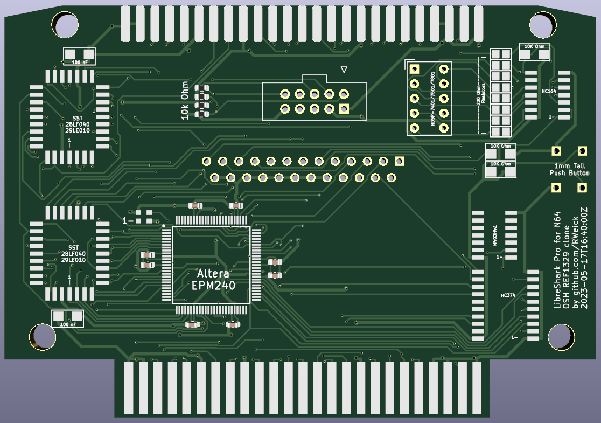

# REF1329-N64-Gameshark-Pro-Clone
This is a fully functional Nintendo 64 GameShark clone. It implements the original LZ9FC17 GAL on an Altera EPM240, and fully supports all functionality to include: parallel port, 7 segment display, and the GS button.

The LZ9FC17 GAL is the same for both the N64 Gameshark and the N64 Gameshark Pro. All firmwares work with this clone. The 7 Segment Display is connected differently on the original Gameshark PCB, so older Gameshark firmwares won't use it correctly on this hardware which is based on the Gameshark Pro PCB.

This is compatible with the Sanni Cartridge Reader's N64 Gameshark programming function as well as the EMS hacked firmware that was released for the first ever Gameshark / Action Replay clone.

The upper EEPROM contains the high bytes of the BIN, and the lower EEPROM contains the low bytes of the BIN. The 2x5 10 pin connector is mapped to the standard Altera USB Blaster pinout for programming. Happy making.

The command address to enable higher address ranges is 0x1040_0400. A write to this address of 0x11 will enable all custom used address ranges beginning with 0x11xx_xxxx. A write to this address of 0x1E will enable all custom used address ranges beginning with 0x1Exx_xxxx.

Huge shoutout to @Parasyte for his ceaseless guidance, mentorship, and encouragement, as well as for originally documenting the hardware registers of the N64 Gameshark. This would not exist without him.

Huge shoutout to the [N64Brew](https://n64brew.dev/wiki/Main_Page) community, who have provided countless resources and documentation that enabled me to complete this project.

[Here's a video of it in action.](https://youtu.be/faCqaDdL_ds)

PCB Thickness: 1.2 mm

